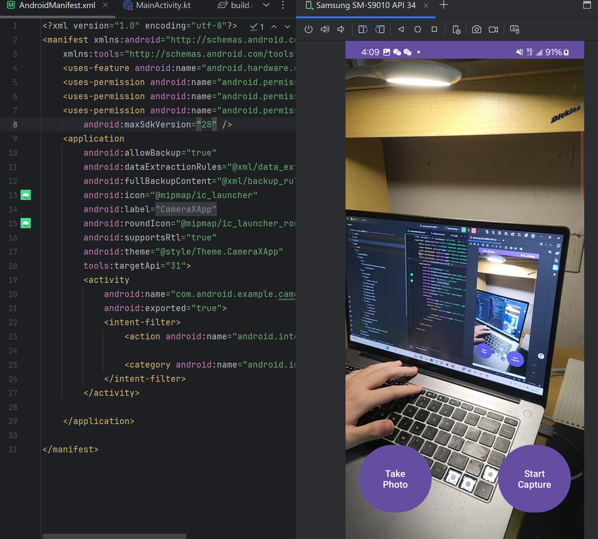

# 实验2.2：构建Android CameraX应用实验报告

## 一、实验概述
本次实验聚焦于Android CameraX库的应用，通过构建相机应用掌握其核心功能。CameraX作为Jetpack组件库（支持API Level 21及以上），简化了相机开发流程，是实现智能应用的重要基础。实验完成后代码已上传至GitHub，本报告详细记录开发过程与核心实现。


## 二、实验目的
1. 掌握CameraX拍照（ImageCapture）功能的基本用法
2. 掌握CameraX视频捕捉（VideoCapture）功能的基本用法
3. 进一步熟悉Kotlin语言在Android开发中的特性应用
4. 理解Android布局设计与硬件权限获取机制


## 三、核心实现步骤及关键代码

### 1. 项目初始化
- 创建Empty Activity项目，语言选择Kotlin，最小支持API Level 21
- 项目结构：主要包含`activity_main.xml`布局文件和`MainActivity.kt`逻辑文件


### 2. 添加CameraX依赖
在`build.gradle`（Module级别）中添加以下依赖，版本使用`1.5.0-alpha06`：
```kotlin
dependencies {
    def camerax_version = "1.5.0-alpha06"
    
    // CameraX核心库
    implementation "androidx.camera:camera-core:$camerax_version"
    implementation "androidx.camera:camera-camera2:$camerax_version"
    
    // 生命周期绑定
    implementation "androidx.camera:camera-lifecycle:$camerax_version"
    
    // 视频捕捉功能
    implementation "androidx.camera:camera-video:$camerax_version"
    
    // 视图组件
    implementation "androidx.camera:camera-view:$camerax_version"
    
    // 可选：ML Kit集成（用于图像分析扩展）
    implementation "androidx.camera:camera-mkit-vision:$camerax_version"
    
    // 可选：扩展功能
    implementation "androidx.camera:camera-extensions:$camerax_version"
}
```


### 3. 布局设计（activity_main.xml）
使用XML布局实现相机预览界面及控制按钮：
```xml
<?xml version="1.0" encoding="utf-8"?>
<androidx.constraintlayout.widget.ConstraintLayout xmlns:android="http://schemas.android.com/apk/res/android"
    xmlns:app="http://schemas.android.com/apk/res-auto"
    android:layout_width="match_parent"
    android:layout_height="match_parent">

    <!-- 相机预览视图 -->
    <androidx.camera.view.PreviewView
        android:id="@+id/viewFinder"
        android:layout_width="match_parent"
        android:layout_height="match_parent"
        app:layout_constraintTop_toTopOf="parent"
        app:layout_constraintBottom_toBottomOf="parent"
        app:layout_constraintStart_toStartOf="parent"
        app:layout_constraintEnd_toEndOf="parent"/>

    <!-- 拍照按钮 -->
    <Button
        android:id="@+id/takePhotoBtn"
        android:layout_width="wrap_content"
        android:layout_height="wrap_content"
        android:text="TAKE PHOTO"
        app:layout_constraintBottom_toBottomOf="parent"
        app:layout_constraintEnd_toEndOf="parent"
        app:layout_constraintStart_toStartOf="parent"
        app:layout_constraintVertical_bias="0.9"/>

    <!-- 录像按钮 -->
    <Button
        android:id="@+id/startCaptureBtn"
        android:layout_width="wrap_content"
        android:layout_height="wrap_content"
        android:text="START CAPTURE"
        app:layout_constraintBottom_toBottomOf="parent"
        app:layout_constraintEnd_toEndOf="parent"
        app:layout_constraintStart_toStartOf="parent"
        app:layout_constraintVertical_bias="0.8"/>

</androidx.constraintlayout.widget.ConstraintLayout>
```


### 4. 权限请求
在`AndroidManifest.xml`中声明相机权限：
```xml
<uses-permission android:name="android.permission.CAMERA"/>
<uses-permission android:name="android.permission.RECORD_AUDIO"/>
<uses-permission android:name="android.permission.WRITE_EXTERNAL_STORAGE"/>
```

在`MainActivity.kt`中动态请求权限：
```kotlin
// 所需权限列表
private val REQUIRED_PERMISSIONS = arrayOf(
    Manifest.permission.CAMERA,
    Manifest.permission.RECORD_AUDIO,
    Manifest.permission.WRITE_EXTERNAL_STORAGE
)

// 检查并请求权限
private fun allPermissionsGranted() = REQUIRED_PERMISSIONS.all {
    ContextCompat.checkSelfPermission(baseContext, it) == PackageManager.PERMISSION_GRANTED
}

// 在onCreate中调用
if (!allPermissionsGranted()) {
    ActivityResultContracts.RequestMultiplePermissions()
    registerForActivityResult(ActivityResultContracts.RequestMultiplePermissions()) { permissions ->
        // 处理权限请求结果
    }.launch(REQUIRED_PERMISSIONS)
}
```


### 5. CameraX核心功能实现（MainActivity.kt）

#### 5.1 初始化相机Provider
```kotlin
private lateinit var cameraProviderFuture: ListenableFuture<ProcessCameraProvider>

override fun onCreate(savedInstanceState: Bundle?) {
    super.onCreate(savedInstanceState)
    setContentView(R.layout.activity_main)
    
    // 初始化相机Provider
    cameraProviderFuture = ProcessCameraProvider.getInstance(this)
    cameraProviderFuture.addListener({
        val cameraProvider = cameraProviderFuture.get()
        bindCameraUseCases(cameraProvider)
    }, ContextCompat.getMainExecutor(this))
}
```

#### 5.2 绑定相机用例（预览、拍照、录像）
```kotlin
private fun bindCameraUseCases(cameraProvider: ProcessCameraProvider) {
    val previewView = findViewById<PreviewView>(R.id.viewFinder)
    
    // 1. 配置预览用例
    val preview = Preview.Builder()
        .build()
        .also { it.setSurfaceProvider(previewView.surfaceProvider) }

    // 2. 配置拍照用例
    val imageCapture = ImageCapture.Builder()
        .setCaptureMode(ImageCapture.CAPTURE_MODE_MAXIMIZE_QUALITY)
        .build()

    // 3. 配置录像用例
    val videoCapture = VideoCapture.Builder()
        .setVideoFrameRate(30)
        .build()

    // 选择后置摄像头
    val cameraSelector = CameraSelector.DEFAULT_BACK_CAMERA

    try {
        // 解绑所有已绑定用例
        cameraProvider.unbindAll()
        
        // 绑定用例到相机
        val camera = cameraProvider.bindToLifecycle(
            this, cameraSelector, preview, imageCapture, videoCapture
        )

        // 拍照按钮点击事件
        findViewById<Button>(R.id.takePhotoBtn).setOnClickListener {
            takePhoto(imageCapture)
        }

        // 录像按钮点击事件
        findViewById<Button>(R.id.startCaptureBtn).setOnClickListener {
            startRecording(videoCapture)
        }

    } catch (e: Exception) {
        Log.e(TAG, "绑定相机用例失败: ${e.message}")
    }
}
```

#### 5.3 拍照功能实现
```kotlin
private fun takePhoto(imageCapture: ImageCapture) {
    // 创建图片保存路径
    val photoFile = File(
        externalMediaDirs.firstOrNull(),
        "${System.currentTimeMillis()}.jpg"
    )

    // 配置输出选项
    val outputOptions = ImageCapture.OutputFileOptions.Builder(photoFile).build()

    // 执行拍照
    imageCapture.takePicture(
        outputOptions,
        ContextCompat.getMainExecutor(this),
        object : ImageCapture.OnImageSavedCallback {
            override fun onImageSaved(outputFileResults: ImageCapture.OutputFileResults) {
                val savedUri = Uri.fromFile(photoFile)
                Toast.makeText(this@MainActivity, "照片已保存至 $savedUri", Toast.LENGTH_LONG).show()
            }

            override fun onError(exception: ImageCaptureException) {
                Log.e(TAG, "拍照失败: ${exception.message}")
            }
        }
    )
}
```

#### 5.4 录像功能实现
```kotlin
private var recording: Recording? = null
private fun startRecording(videoCapture: VideoCapture<Recorder>) {
    // 创建视频保存路径
    val videoFile = File(
        externalMediaDirs.firstOrNull(),
        "${System.currentTimeMillis()}.mp4"
    )
    val outputOptions = VideoCapture.OutputFileOptions.Builder(videoFile).build()

    // 开始录像
    recording = videoCapture.output
        .prepareRecording(this, outputOptions)
        .start(ContextCompat.getMainExecutor(this)) { recordEvent ->
            if (recordEvent is VideoRecordEvent.Finalize) {
                if (!recordEvent.hasError()) {
                    val savedUri = Uri.fromFile(videoFile)
                    Toast.makeText(this, "视频已保存至 $savedUri", Toast.LENGTH_LONG).show()
                } else {
                    Log.e(TAG, "录像失败: ${recordEvent.error}")
                }
            }
        }

    // 切换按钮文本为"停止录像"
    findViewById<Button>(R.id.startCaptureBtn).text = "STOP CAPTURE"
    findViewById<Button>(R.id.startCaptureBtn).setOnClickListener {
        recording?.stop()
        it.text = "START CAPTURE"
        it.setOnClickListener { startRecording(videoCapture) }
    }
}
```


实验结果
 

## 四、扩展实验方向
1. 组合多种用例：如同时实现`Preview + VideoCapture + ImageCapture`
2. 增加图像分析功能：通过`ImageAnalysis`用例实现实时帧处理（如二维码识别、机器学习推理）
3. 优化用户体验：添加相机切换、闪光灯控制、变焦等功能


## 五、实验总结
本次实验成功构建了基于CameraX的相机应用，实现了预览、拍照和录像核心功能。通过实践掌握了：
- CameraX库的依赖配置与初始化流程
- 相机权限的静态声明与动态请求方法
- 四大核心用例（Preview/ImageCapture/VideoCapture/ImageAnalysis）的基本用法
- Kotlin语言在Android开发中的实际应用（如lambda表达式、空安全机制）

后续可进一步探索CameraX的高级特性，结合机器学习模型实现更复杂的智能相机应用。
